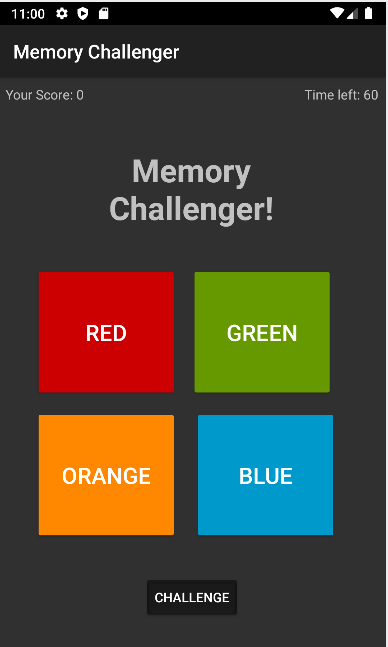

<!-- PROJECT SHIELDS -->
[![MIT License][license-shield]][license-url]
[![LinkedIn][linkedin-shield]][linkedin-url]

<!-- PROJECT LOGO -->
 

  

<h3 align="center">Memory Challenger</h3>

  

    A fun way to test your friends' memory skills.
     
    <a href="https://github.com/acrucetta/android_project_acrucetta"><strong>Explore the docs »</strong></a>
     
     
    <a href="https://github.com/acrucetta/android_project_acrucetta/issues">Report Bug</a>
  

<!-- TABLE OF CONTENTS -->

  
Table of Contents

  <ol>
    <li>
      <a href="#about-the-project">About The Project</a>
      <ul>
        <li><a href="#built-with">Built With</a></li>
      </ul>
    </li>
    <li>
      <a href="#getting-started">Getting Started</a>
    </li>
    <li><a href="#roadmap">Features</a></li>
    <li><a href="#contributing">Contributing</a></li>
    <li><a href="#license">License</a></li>
    <li><a href="#contact">Contact</a></li>
  </ol>

<!-- ABOUT THE PROJECT -->
## About The Project

Memory Challenger is a game for you to test you friend's remembering skills. You can set-up a set of colors, then your friend will take a look at them for a brief second and then try to repeat the pattern.

You will get points based on how many patterns you got right. If you made 0 mistakes you will get as many points as patterns you guessed.

(<a href="#top">back to top</a>)

### Built With

* Kotlin
* Android Studio

(<a href="#top">back to top</a>)

<!-- GETTING STARTED -->

## Getting Started

- **To Run App:** Clone the app, open in Android Studio, put the cursor in the editor window, press Ctrl + R to run.
- **To Run Tests:** Clone the app, open in Android Studio, select the src/main/test directory, press Ctrl + R to run.

(<a href="#top">back to top</a>)

<!-- ROADMAP -->
## Features
- Users can tap multiple colors on the screen
- The colors will be saved into an array
- Users can challenge another user by pressing the "Challenge" button
- Once challenged, users will try multiple patterns
	- The user will get a score in correlation to the amount of patterns he got right
- While the user is setting the colors the timer will stop

(<a href="#top">back to top</a>)

<!-- CONTRIBUTING -->
## Contributing

Contributions are what make the open source community such an amazing place to learn, inspire, and create. Any contributions you make are **greatly appreciated**.

If you have a suggestion that would make this better, please fork the repo and create a pull request. You can also simply open an issue with the tag "enhancement".
Don't forget to give the project a star! Thanks again!

1. Fork the Project
2. Create your Feature Branch (`git checkout -b feature/AmazingFeature`)
3. Commit your Changes (`git commit -m 'Add some AmazingFeature'`)
4. Push to the Branch (`git push origin feature/AmazingFeature`)
5. Open a Pull Request

(<a href="#top">back to top</a>)

<!-- LICENSE -->
## License

Distributed under the MIT License. See `LICENSE.txt` for more information.

(<a href="#top">back to top</a>)

<!-- CONTACT -->
## Contact

Andres Crucetta - andres.crucetta@hey.com

(<a href="#top">back to top</a>)

<!-- ACKNOWLEDGMENTS -->

(<a href="#top">back to top</a>)

<!-- MARKDOWN LINKS & IMAGES -->
<!-- https://www.markdownguide.org/basic-syntax/#reference-style-links -->
[contributors-shield]: https://img.shields.io/github/contributors/github_username/repo_name.svg?style=for-the-badge
[contributors-url]: https://github.com/github_username/repo_name/graphs/contributors
[forks-shield]: https://img.shields.io/github/forks/github_username/repo_name.svg?style=for-the-badge
[forks-url]: https://github.com/github_username/repo_name/network/members
[stars-shield]: https://img.shields.io/github/stars/github_username/repo_name.svg?style=for-the-badge
[stars-url]: https://github.com/github_username/repo_name/stargazers
[issues-shield]: https://img.shields.io/github/issues/github_username/repo_name.svg?style=for-the-badge
[issues-url]: https://github.com/github_username/repo_name/issues
[license-shield]: https://img.shields.io/github/license/github_username/repo_name.svg?style=for-the-badge
[license-url]: https://github.com/github_username/repo_name/blob/master/LICENSE.txt
[linkedin-shield]: https://img.shields.io/badge/-LinkedIn-black.svg?style=for-the-badge&logo=linkedin&colorB=555
[linkedin-url]: https://linkedin.com/in/andres-crucetta
[product-screenshot]: https://github.com/acrucetta/android_project_acrucetta/img/gameScreenshot/png
